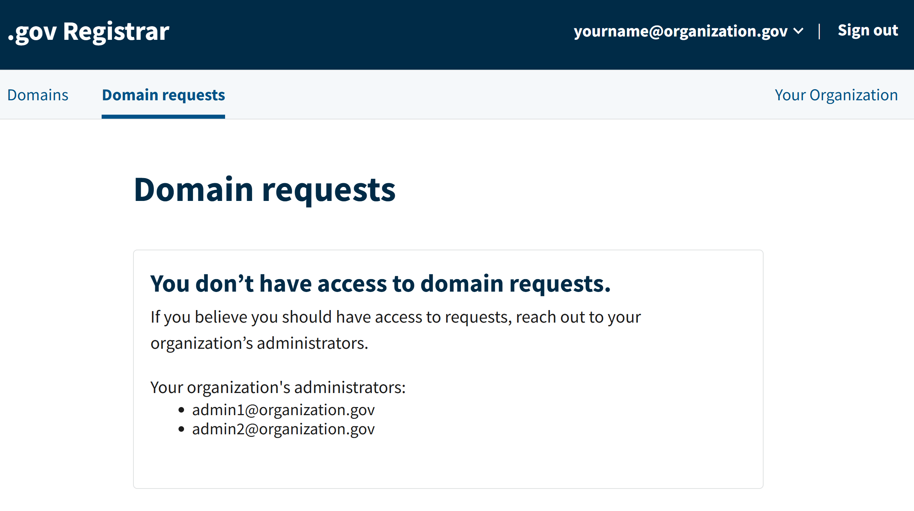

Enterprise mode is designed for organizations that manage multiple .gov domains and want better visibility of their entire portfolio. It provides a holistic view of all domains and requests, and introduces roles and permissions to support detailed oversight.

- [Benefits of enterprise mode](#benefits-of-enterprise-mode)
- [Roles and permissions in enterprise mode](#roles-and-permissions-in-enterprise-mode)
- [What changes for existing users](#what-changes-for-existing-users)
- [Switching to enterprise mode](#switching-to-enterprise-mode)

## Benefits of enterprise mode

Enterprise mode provides a range of advantages, including:

**Centralized domain oversight for your organization.** View all your organization’s .gov domains in one dashboard, including which users manage each domain. You can also add your organization information (name, address, senior official) in one central location and apply it to all your organization’s domains.

**Selective control over permissions.** Decide exactly which actions each member can take, like who in your organization can submit new domain requests to prevent unauthorized registrations.

**Simplified domain request form.** Request a new domain more easily because your organization details are pre-filled. 

**Streamlined review process.** The approval process is faster since only designated representatives can submit requests, and your organization’s shared information only needs to be validated once.

## Roles and permissions in enterprise mode

Enterprise mode introduces two user roles:

* **Organization admin:** Users in this role have full visibility and control across the organization, including all domains, domain requests, and member permissions. 
* **Basic member:** By default, users in this role have limited visibility of the organization because they can only view and manage the domains assigned to them—essentially acting as “domain managers.” Organization admins can grant them additional permissions as needed, including the ability to:
  * View all domains for the organization, not just the ones they manage
  * View all domain requests 
  * Create domain requests 
  * View (but not manage) all member permissions.

**How are admins and basic members different?**

<figure style="margin-left:0px !important;">

<figcaption style="font-style: italic; text-align:center; font-size:0.9em;">The org admin and basic member roles, with optional permissions</figcaption>
</figure>

## What changes for existing users

* **Domain managers no longer have request privileges by default.** Only users explicitly granted “requestor” permissions can submit new domain requests.  
* **Organization information is shared across domains.** Updates to your organization’s profile (e.g., senior official, mailing address) automatically apply to all domains.  
* **Oversight of all domains is centralized.** Organization admins can view all domains and the users associated with each.  
* **The review process is simplified.** New domain requests may be approved more quickly since your organization’s details are already on file.

## Switching to enterprise mode

### Confirm your organization is eligible {.h4}

Enterprise mode is currently available for federal agencies. We expect to onboard state entities, large cities, and other organization types in the future.

### Contact the .gov registrar team {.h4}

[Contact us](../../contact/) to request to enable enterprise mode. You’ll need to identify the initial organization admin (often the CIO, IT lead, or a senior official), and confirm your organization’s official details (address and senior official, with their contact information). 

### Assign roles and permissions {.h4}

Once enterprise mode is active, you can designate which users can manage domains and which can request new ones.