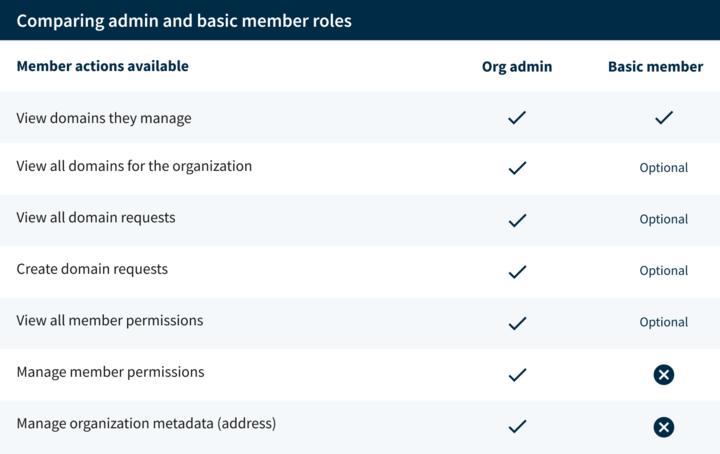

Enterprise mode is designed for organizations that manage multiple .gov domains and want better visibility of their entire portfolio. It provides a holistic view of all domains and requests, and introduces roles and permissions to support detailed oversight.

## **Benefits of enterprise mode**

Enterprise mode provides a range of advantages, including:

### Centralized domain oversight for your organization.

View all your organization’s .gov domains in one dashboard, including which users manage each domain. You can also add your organization information (name, address, senior official) in one central location and apply it to all your organization’s domains.

### Selective control over permissions

Grant only those permissions needed to basic members, like who in your organization can submit new domain requests to prevent unauthorized registrations.

### Simplified domain request form

Request a new domain more easily because your organization details are pre-filled, and our approval process is faster since only designated representatives can submit requests.

### Streamlined review process

Complete the review and approval process for new domains faster since your organization’s shared information only needs to be validated once.

## **Roles and permissions in enterprise mode**

Enterprise mode introduces user roles and permissions to better manage access:

## Organization admin

Full control over the organization’s domains, user roles, and permissions. This individual can see all registered domains for the organization and their settings, review domain managers assigned to each domain, and manage membership and permissions in the organization.

## Basic member

By default, can view and manage only domains they’ve been assigned to (also known as a “Domain Manager”). They can edit technical details, such as Name Servers and DNSSEC for domains they manage, add or remove domain managers from the domain, and edit the security email address for the domain.

### Additional permissions

Basic members can be assigned additional permissions by an organization admin, including:

- View all organization domains and their details, not just the ones they manage  
- View organization domain requests  
- Make domain requests for the organization  
- View organization members

**How are admins and basic members different?**

<figure style="margin-left:0px !important;">

<figcaption style="font-style: italic; text-align:center; font-size:0.9em;">The org admin and basic member roles, with optional permissions</figcaption>
</figure>

## **What changes for existing users**

* **Domain managers no longer have request privileges by default.** Only users explicitly granted “Requester” permissions can submit new domain requests.  
* **Organization information is shared across domains.** Updates to your organization’s profile (e.g., senior official, mailing address) automatically apply to all domains.  
* **Oversight of all domains is centralized.** Organization admins can view all domains and the users associated with each.  
* **The review process is simplified.** New domain requests may be approved more quickly since your organization’s details are already on file.

## **Switching to enterprise mode**

## Confirm your organization is eligible

Enterprise mode is currently available for federal agencies. We expect to onboard state entities, large cities, and other organization types, in the future.

Contact the .gov registrar team

Contact us to request to enable enterprise mode. You’ll need to identify the initial organization admin (often the CIO, IT lead, or a senior official), and confirm your organization’s official details (address and senior official, with their contact information). 

## Assign roles and permissions

Once enterprise mode is active, you can designate which users can manage domains and which can request new ones.